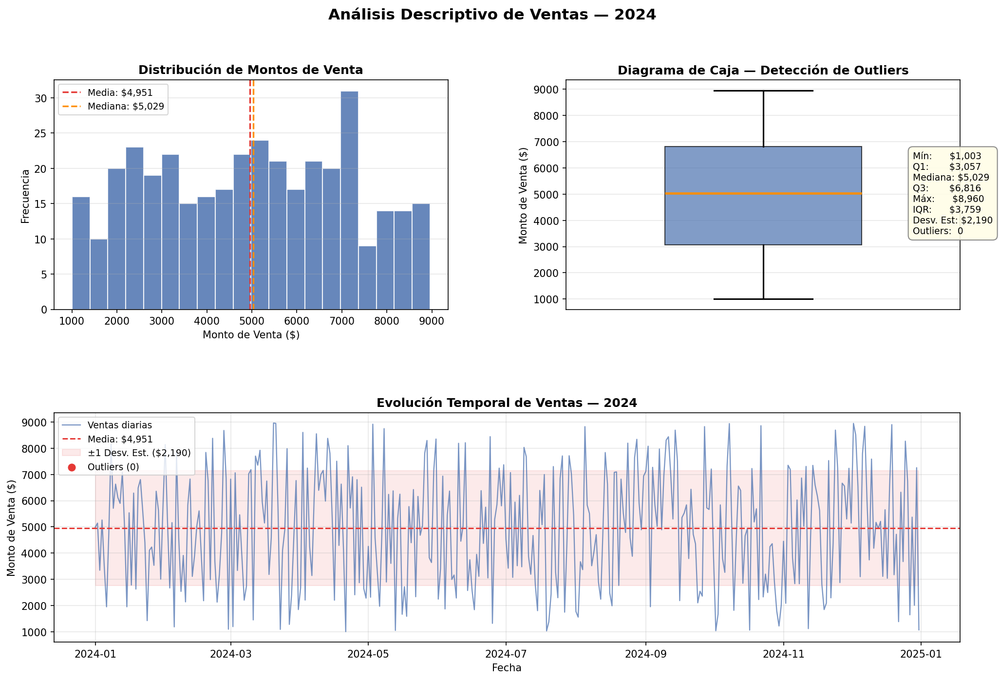
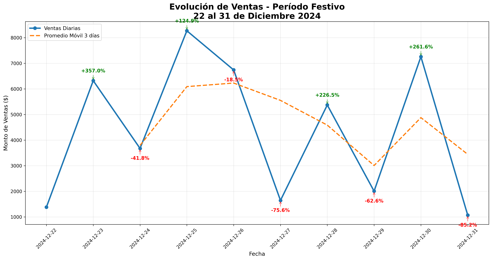
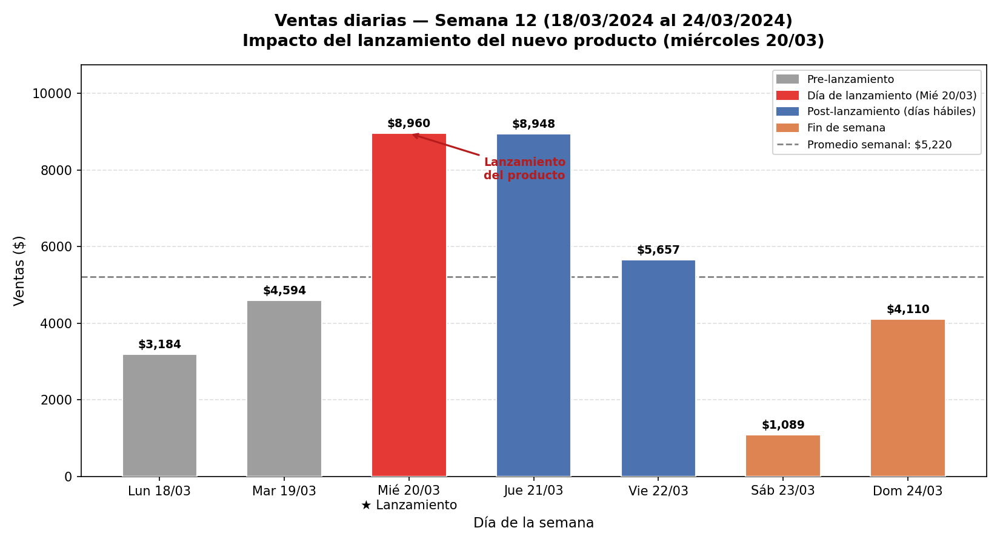

# Análisis de Ventas - Patagonia Market S.A.


## Descripción del Proyecto


Este proyecto consiste en el **análisis de ventas** de **Patagonia Market S.A.**, una pequeña empresa dedicada al comercio minorista de artículos para el hogar, cocina y organización.


Se realizaron tres análisis principales:
- Análisis descriptivo general de ventas

- Análisis temporal durante fechas festivas (22 al 31 de diciembre de 2024)

- Análisis del impacto del lanzamiento de un nuevo producto (semana del 18 al 24 de marzo de 2024)



---
## Estructura del Repositorio

```
UTN-FRSN-OE-TP-Integrador/
├── datos/                  # Archivos de datos (CSV)
├── scripts/                # Scripts de análisis en Python
├── resultados/             # Gráficos e informes generados
├── .gitignore
└── README.md
```
---


## Objetivos


- Transformar datos crudos de ventas en información útil para la toma de decisiones.
- Identificar patrones, picos y caídas en las ventas.
- Evaluar el desempeño durante fechas festivas y el impacto de nuevos productos.
- Aplicar metodologías ágiles (Scrum) y buenas prácticas de control de versiones.


---


## Tecnologías Utilizadas


- **Python 3**
- **Pandas** - Procesamiento de datos
- **Matplotlib** - Generación de gráficos
- **Jira Software** - Gestión de proyecto (Scrum)
- **Git + GitHub** - Control de versiones
- **Google Colab** - Entorno de desarrollo y ejecución


---


## Cómo Ejecutar el Proyecto


### 1. Clonar el repositorio


```bash
git clone https://github.com/PostaElio/UTN-FRSN-OE-TP-Integrador.git
cd UTN-FRSN-OE-TP-Integrador
```


### 2. Instalar dependencias


```bash
pip install pandas matplotlib numpy
```


### 3. Ejecutar los scripts


```bash
# Análisis Descriptivo
python scripts/analisis_descriptivo.py


# Análisis de Fechas Festivas
python scripts/analisis_festivo.py


# Análisis de Lanzamiento de Producto
python scripts/analisis_lanzamiento.py
```


Los gráficos generados se guardarán automáticamente en la carpeta `/resultados`.


## Equipo de Trabajo


| Personaje | Rol | Responsable |
|-----------|-----|-------------|
| Hugo | Líder y Organizador | Elio Posta |
| Paco | Desarrollador Técnico | Elio Posta y Lautaro Villalobos |
| Luis | Revisor y QA | Lautaro Villalobos |


---


## Licencia


Este proyecto fue desarrollado como Trabajo Práctico para la cátedra de Organización Empresarial - UTN Facultad Regional San Nicolás (2026).


---


> Este proyecto fue implementado por **Elio Posta** (Comisión 23) y **Lautaro Villalobos** (Comisión 26).


---


¡Gracias por visitar el repositorio!


